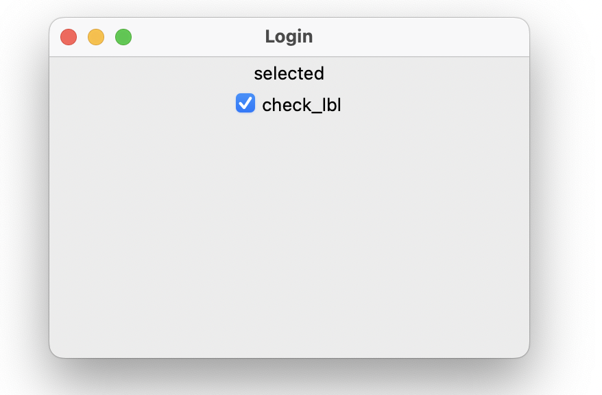

# Cookbook tkinter
{:.no_toc.title}

 
{:.lines-14}


{:.width-50.fright}


{:.page-break-before.toc-title}
# Table des matières

1. TOC
{:toc}

# Préface

Ce livre est destiné aux élèves de première année CFC en
informatique. Il a été créé afin d'avoir une référence sur 
l'utilisation de tkinter au sein du CPNV.

Ce livre n'est en aucun cas une référence pour python. Le langage est
bien plus complexe et avancé que ce que le livre présente. 
Il permettra cependant, d'avoir une bonne connaissance de la syntaxe, et des fonctions de base du langage.

# Les bases

## La fenêtre

### Généralités

En premier lieu, il faut importer la bibliothèque tkinter.

```python
from tkinter import *
```

Puis, il faut créer la fenêtre principale.

```python
window = Tk()
```

A ce stade, si vous exécutez le programme rien ne se passe ou
presque. Une fenêtre s'ouvre et se ferme directement. Pour combler ce
problème, il faut dire à tkinter d'attendre un évènement système et ne
pas fermer le fenêtre. Pour cela, on démarre la boucle principale.

```python
window.mainloop()
```

Un fenêtre s'ouvre tel que celle-ci :

 {:.width-25}

Résumé : Pour initialiser la bibliothèque et ouvrir une fenêtre il faut :

```python
from tkinter import *
window = Tk()
window.mainloop()
```

### Options avancées

Nous pouvons changer le titre, la couleur de fond, la taille de la fenêtre.

Pour changer le titre, il faut utiliser la méthode suivante juste
après la déclaration de la fenêtre.

```python
window.title("introTK")
```

Pour changer la couleur de fond, nous devons utiliser la méthode `configure`.

```python
window.configure(bg='blue')
```

Et pour finir, pour changer sa taille, il faut utiliser la méthode `geometry`.

```python
window.geometry("400x200")
```

Ce qui nous donne comme code final :

```python
from tkinter import *
window = Tk()
window.title("introTK")
window.configure(bg='blue')
window.geometry("400x200")
window.mainloop()
```

Et le résultat 

 {:.width-50}

## Placer des objets

### Le Label

Si l'on veut écrire du texte d'information dans une fenêtre, nous
pouvons utiliser un label.

Pour déclarer un label, il faut créer un variable entre la
configuration de la fenêtre et la boucle principale comme tel :

```python
mon_label = Label(window,text="Ceci est un label")
```

Ceci n'affiche pas encore le label sur la fenêtre. Il faut utiliser la
méthode pack afin de l'ajouter à la fenêtre courante.

[//]: <> (TODO : créer chapitre et mettre lien ici)


```python
from tkinter import *
window = Tk()
window.title("introTK")
window.geometry("400x200")

mon_label = Label(window,text="Ceci est un label")
mon_label.pack()

window.mainloop()
```

Ce qui donne :

 {:.width-50}

Pour changer le texte d'un label après sa déclaration, nous pouvons
utiliser la méthode `config()` avec comme argument le terme `text=`.

```python
mon_label.config(text="ceci est un texte changé")
```

### Le bouton

La création d'un bouton se fait de la même manière qu'un label.

```python
mon_bouton = Button(window,text="Ceci est un bouton")
mon_bouton.pack()
```

Ceci ajout un bouton sur la fenêtre mais il n'y a pas
d'action/réaction lorsqu'on appuie sur le bouton. Pour palier à ce
problème, il faut créer un fonction et lier celle-ci au bouton.

```python
def dit_bonjour():
    print("hello")

mon_bouton = Button(window,text="Ceci est un bouton",command=dit_bonjour)
mon_bouton.pack()
```

### mise en commun

Afin de voir un expemple complet, nous allons créer un label, et un
bouton sur un fenêtre tk. Lorsque l'utilisateur appuie sur le bouton,
le texte du label change.

```python
from tkinter import *

def dit_bonjour():
    global mon_label
    mon_label.config(text="hey, bonjour !")

window = Tk()
window.title("introTK")
window.geometry("400x200")

mon_label = Label(window,text="Ceci est un label")
mon_label.pack()

mon_bouton = Button(window,text="Ceci est un bouton",command=dit_bonjour)
mon_bouton.pack()

window.mainloop()
```

Ce qui donne :

{:.width-33}
{:.width-33}

Remarque : Nous utilisons dans le code ci-dessus la commande
`global` devant le nom d'une variable. Normalement, dans une fonction
il est permis d'utiliser uniquement les variables passées en paramètre
ou créées au sein même de la fonction. Si l'on veut utiliser une
variable en dehors de la fonction, il faut préciser à python de la
chercher à l'extérieur de la fonction. Le mot clé `global` est prévu
pour cela.

### Un Entry

Lorsque l'on veut demander à l'utilisateur de donner un nombre, une
chaîne de caractère (tel qu'un nom, un prénom, etc...), nous avons deux
possibilités. La première est d'utiliser un champ qui comporte une
seule et unique ligne alors il faut la classe `Entry`. Si nous devons demander plus
d'une ligne, la classe `Text` est là pour cela. Dans le cadre de ce
document, nous ne verrons que la partie `Entry`. Généralement le
champ `Entry` est précédé d'un label afin d'identifier ce que
l'utilisateur doit entrer.

```python
lbl_nom = Label(window,text="Votre nom")
lbl_nom .pack(side=LEFT)

txt_nom = Entry(window)
txt_nom.pack(side=LEFT)
```

La méthode `get()` permet de récupérer le contenu du champ `Entry`.

```python
txt_nom = Entry(window)
txt_nom.pack(side=LEFT)

nom_utilisateur = txt_nom.get()
```

Voici un exemple complet permettant de demander à l'utilisateur son
prénom et de lui dire bonjour. Nous utilisons deux label, un bouton et
un entry.

```python
from tkinter import *

def dit_bonjour():
    global mon_label, txt_nom
    message = "Hey, " + txt_nom.get() + " bonjour !"
    lbl_hello.config(text=message)

window = Tk()
window.title("introTK")
window.geometry("400x200")

lbl_hello = Label(window,text="")
lbl_hello .pack(side=TOP)

lbl_nom = Label(window,text="Votre nom")
lbl_nom .pack(side=LEFT)

txt_nom = Entry(window)
txt_nom.pack(side=LEFT)


bt_bonjour = Button(window,text="Dire bonjour",command=dit_bonjour)
bt_bonjour.pack(side=LEFT)

window.mainloop()
```

{:.width-50}

Il est possible de masquer le texte qui s'affiche dans un
`Entry`. Pour cela, il suffit d'utiliser l'option `show="*"`.

```python
from tkinter import *

root = Tk()
root.title('Login')
root.geometry("350x220")

password_label = Label(text='Password:')
password_label.pack()
password = Entry(show="*")
password.pack(anchor="w", padx=10, pady=5, fill=X)

root.mainloop()
```

{:.width-50}

## Mise en `pack()`

Afin de faire une interface avancée, il faut que nous parlions de la
méthode `pack()` de manière un peu plus exhaustive. Nous allons voir
plusieurs exemples afin d'illustrer le fonctionnement de `pack()`.

### un paquetage par défaut

Voici donc le premier exemple.

```python
from tkinter import *

root = Tk()
root.title("IntroTK - pack")
root.geometry("200x200")


lbl_demo1 = Label(root, text="demo 1", bg="red", fg="white")
lbl_demo1.pack()


lbl_demo2 = Label(root, text="demo 2", bg="blue", fg="white")
lbl_demo2.pack()

bt_demo = Button(root, text="click me")
bt_demo.pack()

txt_demo = Entry(root)
txt_demo.pack() 

root.mainloop()
```

{:.width-50}

Nous constatons que la méthode `pack()` empile horizontalement les objets (Label,
Botton et Entry) et centre ceux-ci.

Avant d'aller plus loin, il faut comprendre que tkinter utilise un
système de coordonnées basé sur le coin gauche haut.

{:.width-50}

### Espacement (padx, pady, ipadx et ipady)

Il est possible d'ajouter un espacement (avant, après, en haut et en
bas) d'un objet par rapport à un autre. Il s'agit des attributs
`padx` et `pady`. Il est aussi possible d'ajouter de l'espace au sein
même de l'objet. Il s'agit de `ipadx`et `ipady`.

Voyons déjà l'effet des `ipad` :

```python
from tkinter import *

root = Tk()
root.title("IntroTK - pack")
root.geometry("200x200")

lbl_demo1 = Label(root, text="demo 1", bg="red", fg="white")
lbl_demo1.pack(ipadx=10, ipady=10)

lbl_demo2 = Label(root, text="demo 2", bg="blue", fg="white")
lbl_demo2.pack()

root.mainloop()
```

{:.width-50}

Nous constatons que le premier label a été élargi dans les deux axes.

Regardons maintenant l'effet des `pad` :

```python
from tkinter import *

root = Tk()
root.title("IntroTK - pack")
root.geometry("200x200")

lbl_demo1 = Label(root, text="demo 1", bg="red", fg="white")
lbl_demo1.pack(padx=10, pady=10)

lbl_demo2 = Label(root, text="demo 2", bg="blue", fg="white")
lbl_demo2.pack()

root.mainloop()
```

{:.width-50}

Nous constatons ici que qu'un espace entre les labels a été ajouté.

### On s'étend (the `fill`option)

Il est possible d'étendre un objet dans les deux axes. Reprenons
l'exemple précédent.

```python
from tkinter import *

root = Tk()
root.title("IntroTK - pack")
root.geometry("200x200")

lbl_demo1 = Label(root, text="demo 1", bg="red", fg="white")
lbl_demo1.pack(ipadx=10, ipady=10, fill=X)

lbl_demo2 = Label(root, text="demo 2", bg="blue", fg="white")
lbl_demo2.pack(ipadx=15, ipady=20, fill=Y)

root.mainloop()
```

{:.width-50}

Nous constatons que le `fill` en X fonctionne mais il ne se passe rien
avec le `fill` en Y. Ceci est du à l'aire que consacre tkinter à
l'objet (voir image ci-dessous).

{:.width-50}

Comme vous le constatez, l'espace alloué pour les box ne permet pas
d'étendre sur l'axe des y. 

### On s'étend encore un peu plus ...

Pour palier au problème rencontré au chapitre précédent, nous allons
utiliser le paramètre `expand`.

```python
from tkinter import *

root = Tk()
root.title("IntroTK - pack")
root.geometry("200x200")

lbl_demo1 = Label(root, text="demo 1", bg="red", fg="white")
lbl_demo1.pack(ipadx=10, ipady=10, expand=True)

lbl_demo2 = Label(root, text="demo 2", bg="blue", fg="white")
lbl_demo2.pack(ipadx=10, ipady=10, fill=Y)

root.mainloop()
```

{:.width-50}

Ce qui nous permet de faire un `fill` sur les deux axes comme tel :

```python
from tkinter import *

root = Tk()
root.title("IntroTK - pack")
root.geometry("200x200")

lbl_demo1 = Label(root, text="demo 1", bg="red", fg="white")
lbl_demo1.pack(ipadx=10, ipady=10, expand=True, fill=BOTH)  

lbl_demo2 = Label(root, text="demo 2", bg="blue", fg="white")
lbl_demo2.pack(ipadx=10, ipady=10, fill=Y)

root.mainloop()
```

{:.width-50}

Si nous utilisons aussi l'`expand` sur le second label, il y a
répartition entre les deux label.

```python
from tkinter import *

root = Tk()
root.title("IntroTK - pack")
root.geometry("200x200")

lbl_demo1 = Label(root, text="demo 1", bg="red", fg="white")
lbl_demo1.pack(ipadx=10, ipady=10, expand=True, fill=BOTH)  

lbl_demo2 = Label(root, text="demo 2", bg="blue", fg="white")
lbl_demo2.pack(ipadx=10, ipady=10, expand=True)

root.mainloop()
```

{:.width-50}

### Encore ou anchor 

La propriété `anchor` permet d'ancrer un objet dans le coin de
**l'espace définit**. Il accepte les valeurs suivantes :

| Sticky | Description                 |
|--------|-----------------------------|
|        |                             |
| N      | Nord ou En haut au centre   |
| S      | Sud ou en bas au centre     |
| E      | Est ou à droite centrer     |
| W      | Ouest ou à gauche centrer   |
| NW     | Nord Ouest en haut à gauche |
| NE     | Nord Est en haut à droite   |
| SE     | Sud Est en bas à droite     |
| SW     | Sud Ouest en bas à gauche   |
| CENTER | Centrer                     |

{:.width-50}

Remarque : Attention, l'accroche ne se fait que dans le cadre de
l'objet. Il n'est pas possible d'en sortir.

Prenons l'exemple suivant :

```python
from tkinter import *
root = Tk()
root.title("IntroTK - pack")
root.geometry("200x200")

lbl_demo1 = Label(root, text="demo 1", bg="red", fg="white")
lbl_demo1.pack(expand=True, anchor="se")

lbl_demo2 = Label(root, text="demo 2", bg="blue", fg="white")
lbl_demo2.pack(expand=True)

root.mainloop()
```

{:.width-50}

Nous constatons que le label rouge ne s'ancre pas complètement au
sud. Afin de mieux comprendre ce qui se passe, il faut ajouter un
Frame de type Label tel que : 

```python
from tkinter import *

root = Tk()
root.title("IntroTK - pack")
root.geometry("200x200")

lblf_1 = LabelFrame(root, text="demo 1")
lblf_1.pack(expand=True,fill=BOTH)

lblf_2 = LabelFrame(root, text="demo 2")
lblf_2.pack(expand=True, fill=BOTH)

lbl_demo1 = Label(lblf_1, text="demo 1", bg="red", fg="white")
lbl_demo1.pack()

lbl_demo2 = Label(lblf_2, text="demo 2", bg="blue", fg="white")
lbl_demo2.pack()

root.mainloop()
```

{:.width-50}

Il sera impossible d'ancrer le label "demo 1" tout en bas de la
fenêtre. En effet, l'espace alloué au label rouge est délimité par la
moitié de l'écran. Comme nous pouvons le constater grâce au `Frame`.

Regardons donc, ce que fait un `anchor='SE` sur le `label 1`.

```python
from tkinter import *

root = Tk()
root.title("IntroTK - pack")
root.geometry("200x200")

lblf_1 = LabelFrame(root, text="demo 1")
lblf_1.pack(expand=True,fill=BOTH)

lblf_2 = LabelFrame(root, text="demo 2")
lblf_2.pack(expand=True, fill=BOTH)

lbl_demo1 = Label(lblf_1, text="demo 1", bg="red", fg="white")
lbl_demo1.pack()

lbl_demo2 = Label(lblf_2, text="demo 2", bg="blue", fg="white")
lbl_demo2.pack()

root.mainloop()
```

{:.width-50}

### Changer d'orientation `side`.

Comme nous l'avions vu au [début de
chapitre](#un-paquetage-par-défaut), `pack` empile les objets l'un en
dessous de l'autre.

{:.width-50}

Nous pouvons changer ce comportement avec le paramètre `side`. Voici
les options possible du paramètre `side`.

| Sticky | Description                                                |
|--------|------------------------------------------------------------|
| TOP    | Emplie les objets de haut en bas (comportement par défaut= |
| LEFT   | Emplie les objets de gauche à droite                       |
| RIGHT  | Emplie les objets de droite à gauche                       |
| BOTTOM | Emplie les objet de bas en haut.                           |

Reprenons l'exemple du début de chapitre en changeant seulement l'orientation.

#### `side`LEFT

```python
from tkinter import *

root = Tk()
root.title("IntroTK - pack")
root.geometry("400x200")

lbl_demo1 = Label(root, text="demo 1", bg="red", fg="white")
lbl_demo1.pack(side=LEFT)

lbl_demo2 = Label(root, text="demo 2", bg="blue", fg="white")
lbl_demo2.pack(side=LEFT)

bt_demo = Button(root, text="click me")
bt_demo.pack(side=LEFT)

txt_demo = Entry(root)
txt_demo.pack(side=LEFT)

root.mainloop()
```

{:.width-50}

#### `side`RIGHT

```python
from tkinter import *

root = Tk()
root.title("IntroTK - pack")
root.geometry("400x200")

lbl_demo1 = Label(root, text="demo 1", bg="red", fg="white")
lbl_demo1.pack(side=RIGHT)

lbl_demo2 = Label(root, text="demo 2", bg="blue", fg="white")
lbl_demo2.pack(side=RIGHT)

bt_demo = Button(root, text="click me")
bt_demo.pack(side=RIGHT)

txt_demo = Entry(root)
txt_demo.pack(side=RIGHT)

root.mainloop()
```

{:.width-50}

#### `side`BOTTOM

```python
from tkinter import *

root = Tk()
root.title("IntroTK - pack")
root.geometry("200x200")

lbl_demo1 = Label(root, text="demo 1", bg="red", fg="white")
lbl_demo1.pack()

lbl_demo2 = Label(root, text="demo 2", bg="blue", fg="white")
lbl_demo2.pack()

bt_demo = Button(root, text="click me")
bt_demo.pack()

txt_demo = Entry(root)
txt_demo.pack() 

root.mainloop()
```

{:.width-50}

#### `side` mixte

Il est aussi possible de mélanger les options d'orientation. Nous
pouvons donc faire ceci :

```python
from tkinter import *

root = Tk()
root.title("IntroTK - pack")
root.geometry("200x200")

lbl_demo1 = Label(root, text="demo 1", bg="red", fg="white")
lbl_demo1.pack(side=LEFT,expand=True, fill=BOTH)  

lbl_demo2 = Label(root, text="demo 2", bg="blue", fg="white")
lbl_demo2.pack( side=TOP, expand=True, fill=BOTH)

lbl_demo3 = Label(root, text="demo 2", bg="blue", fg="white")
lbl_demo3.pack(side=TOP, expand=True, fill=BOTH)

root.mainloop()
```

{:.width-50}

#### Un exemple concret : login

Pour finir ce chapitre, regardons la création d'une fenêtre de login.

```python
from tkinter import *

root = Tk()
root.title('Login')
root.geometry("350x220")

username_label  = Label(text='Username:')
username_label.pack(anchor="w",padx=10, pady=5)
username = Entry()
username.pack(anchor="w", padx=10, pady=5, fill=X)

password_label = Label(text='Password:')
password_label.pack(anchor="w", padx=10, pady=5)
password = Entry(show="*")
password.pack(anchor="w", padx=10, pady=5, fill=X)
    
login_button = Button(text='Login').pack(anchor="w", padx=10, pady=5)

root.mainloop()
```

{:.width-50}

# Les objets avancés

## Un checkbox

Il est possible de créer un liste d'options à sélectionner (ou checkbox).

```python
checkbox = Checkbutton(container,
                text='<checkbox label>',
                command=check_changed,
                variable=checkbox_var,
                onvalue='<value_when_checked>',
                offvalue='<value_when_unchecked>')
```

Voici un exemple simple d'emploi :

```python
from tkinter import *

def check_changed():
    lbl_to_change.config(text=f"{checkbox_var.get()}")

root = Tk()
root.title('Login')
root.geometry("350x220")
checkbox_var = StringVar()
lbl_to_change = Label(root)
lbl_to_change.pack()

checkbox = Checkbutton(root,
                text='check_lbl',
                command=check_changed,
                variable=checkbox_var,
                onvalue='selected',
                offvalue='unselected')
checkbox.pack()
root.mainloop()
```

{:.width-50}

## Radio Button

Il est aussi possible d'utiliser des bouton radio en tkinter. Voici la syntaxe :

```python
selected = StringVar()
r1 = Radiobutton(root, text='Option 1', value='Value 1', variable=selected)
r2 = Radiobutton(root, text='Option 2', value='Value 2', variable=selected)
r3 = Radiobutton(root, text='Option 3', value='value 3', variable=selected)
```

Voici un exemple complet :

```python
from tkinter import *
from tkinter.messagebox import showinfo

#root window
root = Tk()
root.geometry('400x300')
root.resizable(False, False)
root.title('Radio Button Demo')

def show_selected_size():
    showinfo(
        title='Result',
        message=selected_size.get()
    )

selected_size = StringVar()
sizes = (('Small', 'S'),
         ('Medium', 'M'),
         ('Large', 'L'),
         ('Extra Large', 'XL'),
         ('Extra Extra Large', 'XXL'))

#label
label = Label(text="What's your t-shirt size?")
label.pack(fill='x', padx=5, pady=5)

#radio buttons
for size in sizes:
    r = Radiobutton(
        root,
        text=size[0],
        value=size[1],
        variable=selected_size
    )
    r.pack(fill='x', padx=5, pady=5)

#button
button = Button(
    root,
    text="Get Selected Size",
    command=show_selected_size)

button.pack(fill='x', padx=5, pady=5)

root.mainloop()
```

{:.width-75}


## ListBox


Voici un exemple d'emploi d'une listbox :

```python
list_items = tk.Variable(value=items)
listbox = tk.Listbox(
    container,
    height,
    listvariable=list_items
)
```

Il est possible de définir le mode de sélection. Voici les options
possibles :


| selectmode | Description                                                                                                                                          |
|------------|------------------------------------------------------------------------------------------------------------------------------------------------------|
| BROWSE     | Permet une sélection unique. Si une option est sélectionnée, et que l'on la déplace, la sélection suit. C'est option par défaut.                     |
| EXTENDED   | Séection multiple. Permier click permet de sélectioner le permier ojet, le second clic permet de sélectionner tous les options entre les deux clics. |
| SINGLE     | Sélection simple.                                                                                                                                    |
| MULTIPLE   | Sélection muliple. Chaque clique permet de séectionner une option. Si l'option est déjà sélectionnée, elle sera desélectionnée.                      |
|            |                                                                                                                                                      |


Un exemple complet :

```python
from tkinter import *
from tkinter import messagebox

def items_selected(event):
    # get all selected indices
    selected_indices =  listbox.curselection()
    # get selected items
    selected_langs = ",".join([listbox.get(i) for i in selected_indices])
    msg = f'You selected: {selected_langs}'
    messagebox.showinfo(title='Information', message=msg)

# create the root window
root = Tk()
root.title('Listbox')
root.geometry("300x300")


# create a list box
langs = ('Java', 'C#', 'C', 'C++', 'Python',
         'Go', 'JavaScript', 'PHP', 'Swift')

list_lang = Variable(value=langs)

listbox = Listbox(
    root,
    listvariable=list_lang,
    height=6,
    selectmode=MULTIPLE
)

listbox.pack(expand=True, fill=BOTH)
        
listbox.bind('<<ListboxSelect>>', items_selected)

root.mainloop()
```

# Aller plus loin

Dans ce livre, nous avons abordé une petite partie de tkinter. Il y a
pleins d'objets et de techniques de programmation que nous n'avons pas
abordé. Ce livre est en partie basé sur le site : [python
tutorial](https://www.pythontutorial.net/tkinter/). 

Attention, cependant les exemples présent sur le site utilisent une
sur-couche de tkinter appelée themed tk (ttk).  Il faut
adapter le code afin qu'il soit compatible avec la version simple de tkinter.

