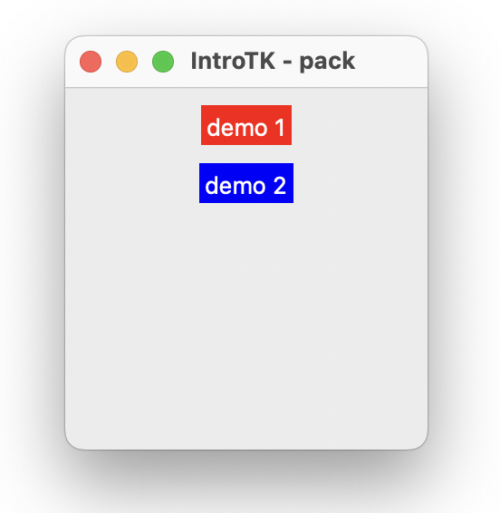
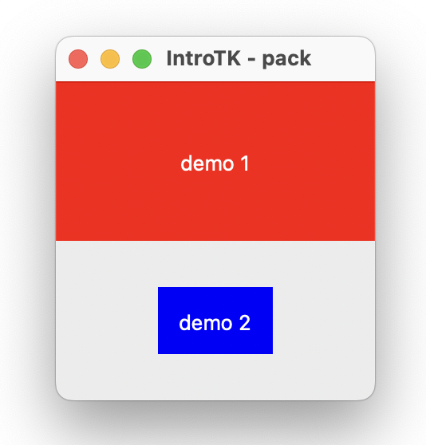

# Cookbook tkinter
{:.no_toc.title}


{:.lines-14}


{:.width-50.fright}


{:.page-break-before.toc-title}
# Table des matières

1. TOC
{:toc}

# Préface

Ce livre est destiné aux élèves de première année CFC en
informatique. Il a été créé afin d'avoir une référence sur 
l'utilisation de tkinter au sein du CPNV.

Ce livre n'est en aucun cas une référence pour python. Le langage est
bien plus complexe et avancé que ce que le livre présente. 
Il permettra cependant, d'avoir une bonne connaissance de la syntaxe, et de fonction de base du langage.

# Les bases

## La fenêtre

### Généralités

En premier lieu, il faut importer la bibliothèque tkinter.

```python
from tkinter import *
```

Puis, il faut créer la fenêtre principale.

```python
window = Tk()
```

A ce stade, si vous exécuter le programme rien ne se passe ou
presque. Une fenêtre s'ouvre et se ferme directement. Pour combler ce
problème, il faut dire à tkinter d'attendre un évènement système et ne
pas fermer le fenêtre. Pour cela, on démarre la boucle principale.

```python
window.mainloop()
```

Un fenêtre s'ouvre tel que celle-ci :


 {:.width-25}
 
 Résumé : Pour initialiser la bibliothèque et ouvrir une fenêtre il
 faut :
 
 
 ```python
from tkinter import *
window = Tk()
window.mainloop()
```
 
### Options avancées

Nous pouvons changer le titre, la couleur de fond, la taille de la
fenêtre.

Pour changer le titre, il faut utiliser la méthode suivante juste
après la déclaration de la fenêtre.

```python
window.title("introTK")
```

Pour change la couleur de fond, nous devons utiliser la méthode
"configure".


```python
window.configure(bg='blue')
```

Et pour finir, pour changer sa taille, il faut utiliser la méthode
"geometry".

```python
window.geometry("400x200")
```

Ce qui nous donne comme code final :


```python
from tkinter import *
window = Tk()
window.title("introTK")
window.configure(bg='blue')
window.geometry("400x200")
window.mainloop()
```

Et le résultat 

 {:.width-50}
 
## Placer des objets

### Le Label

Si l'on veut écrire du texte d'information dans une fenêtre, nous
pouvons utiliser un label.

Pour déclarer un label, il faut créer un variable entre la
configuration de la fenêtre et la boucle principale comme tel :

```python
mon_label = Label(window,text="Ceci est un label")
```

Ceci n'affiche pas encore le label sur la fenêtre. Il faut utiliser la
méthode pack afin de l'ajouter à la fenêtre courante.

[//]: <> (TODO : créer chapitre et mettre lien ici)


```python
from tkinter import *
window = Tk()
window.title("introTK")
window.geometry("400x200")

mon_label = Label(window,text="Ceci est un label")
mon_label.pack()

window.mainloop()
```

Ce qui donne :

 {:.width-50}


Pour changer, le texte d'un label après sa déclaration, nous pouvons
utiliser la méthode `config()` avec comme argument le terme `text=`.
	

```python
mon_label.config(text="ceci est un texte changé")
```

### Le bouton

La création d'un bouton se fait de la même manière qu'un label.

```python
mon_bouton = Button(window,text="Ceci est un bouton")
mon_bouton.pack()
```

Ceci ajout un bouton sur la fenêtre mais il n'y a pas
d'action/réaction lorsqu'on appuie sur le bouton. Pour palier à ce
problème, il faut créer un fonction et lier celle-ci au bouton.


```python
def dit_bonjour():
	print("hello")
	
mon_bouton = Button(window,text="Ceci est un bouton",command=dit_bonjour)
mon_bouton.pack()
```

### mise en commun

Afin de voir un expemple complet, nous allons créer un label, et un
bouton sur un fenêtre tk. Lorsque l'utilisateur appuie sur le bouton ,
le texte du label change.

```python
from tkinter import *

def dit_bonjour():
    global mon_label
    mon_label.config(text="hey, bonjour !")

window = Tk()
window.title("introTK")
window.geometry("400x200")

mon_label = Label(window,text="Ceci est un label")
mon_label.pack()


    
mon_bouton = Button(window,text="Ceci est un bouton",command=dit_bonjour)
mon_bouton.pack()

window.mainloop()
```

Ce qui donne :


{:.width-33}
{:.width-33}

Remarque : Nous utilisons dans le code ci-dessous la commande
`global` devant le nom d'une variable. Normalement, dans un fonction
il est permis d'utiliser uniquement les variables passées en paramètre
ou créée au sein même de la fonction. Si l'on veut utiliser une
variable en dehors de la fonction, il faut préciser à python de la
chercher à l'extérieur de la fonction. Le mot clé `global`est prévu
pour cela.

### Un peu de texte 

Lorsque l'on veut demander à l'utilisateur de donner un nombre, une
chaîne de caractère (tel qu'un nom, un prénom, etc...). Nous avons deux
possibilités. La première est d'utiliser un champ qui compotre une
seule et unique ligne la classe `Entry`. Si nous devons demander plus
d'une ligne, la classe `Text`est là pour cela. Dans le cadre de ce
document, nous ne verrons que la partie `Entry`. Généralement, le
champ `Entry`est précéder d'un label afin d'identifier ce que
l'utilisateur doit entrer.


```python
lbl_nom = Label(window,text="Votre nom")
lbl_nom .pack(side=LEFT)

txt_nom = Entry(window)
txt_nom.pack(side=LEFT)
```

La méthode `get()` permet de récupérer le contenu du champ `Entry`.


```python
txt_nom = Entry(window)
txt_nom.pack(side=LEFT)

nom_utilisateur = txt_nom.get()
```


Voici un exemple complet permettant de demander à l'utilisateur son
prénom et de lui dire bonjour. Nous utilisons deux label, un bouton et
un entry.


```python
from tkinter import *

def dit_bonjour():
    global mon_label, txt_nom
    message = "Hey, " + txt_nom.get() + " bonjour !"
    lbl_hello.config(text=message)

window = Tk()
window.title("introTK")
window.geometry("400x200")

lbl_hello = Label(window,text="")
lbl_hello .pack(side=TOP)

lbl_nom = Label(window,text="Votre nom")
lbl_nom .pack(side=LEFT)

txt_nom = Entry(window)
txt_nom.pack(side=LEFT)


    
bt_bonjour = Button(window,text="Dire bonjour",command=dit_bonjour)
bt_bonjour.pack(side=LEFT)

window.mainloop()
```


{:.width-50}


## Mise en `pack()`

Afin de faire une interface avancée, il faut que nous parlions de la
méthode `pack()`de manière un peu plus exhaustive. Nous allons voir
plusieurs exemples afin d'illustré le fonctionnement de `pack()`.

###  un paquetage pas défaut

Voici donc le premier exemple.


```python
from tkinter import *

root = Tk()
root.title("IntroTK - pack")
root.geometry("200x200")


lbl_demo1 = Label(root, text="demo 1", bg="red", fg="white")
lbl_demo1.pack()


lbl_demo2 = Label(root, text="demo 2", bg="blue", fg="white")
lbl_demo2.pack()

bt_demo = Button(root, text="click me")
bt_demo.pack()

txt_demo = Entry(root)
txt_demo.pack() 

root.mainloop()
```


{:.width-50}

Nous constatons que la méthode `pack()` emplie horizontalement les objets (Label,
Botton et Entry) et centre ceux-ci.

Avant d'aller plus loin, il faut comprendre que tkinter utilise en
système de coordonnées basé sur le coin gauche haut.

{:.width-50}


### Espacement (padx, pady)

Il est possible d'ajouter un espacement (avant, après, en haut et en
bas), d'un objet par rapport à un autre. Il s'agit des attributs
`ipadx` et `ipady`.


```python
from tkinter import *

root = Tk()
root.title("IntroTK - pack")
root.geometry("200x200")


lbl_demo1 = Label(root, text="demo 1", bg="red", fg="white")
lbl_demo1.pack(ipadx=10, ipady=10)


lbl_demo2 = Label(root, text="demo 2", bg="blue", fg="white")
lbl_demo2.pack(ipadx=15, ipady=20)


root.mainloop()
```


{:.width-50}


### On s'étend (the `fill`option)

Il est possible d'étendre à un objet dans les deux axes. Reprenons
l'exemple précédent.


```python
from tkinter import *

root = Tk()
root.title("IntroTK - pack")
root.geometry("200x200")


lbl_demo1 = Label(root, text="demo 1", bg="red", fg="white")
lbl_demo1.pack(ipadx=10, ipady=10, fill=X)


lbl_demo2 = Label(root, text="demo 2", bg="blue", fg="white")
lbl_demo2.pack(ipadx=15, ipady=20, fill=Y)


root.mainloop()
```


{:.width-50}


Nous constatons que le `fill`en X fonctionne mais, il ne se passe rien
avec le `fill` en y. Ceci est du à l'aire que consacre tkinter à
l'objet (voir image ci-dessous).

{:.width-50}

Comme vous le constatez, l'espace allouer pour les box ne permet pas
d'étendre sur l'axe des y. 

### On s'étend encore un peu plus ...

Pour palier au problème rencontrer au chapitre précédent, nous allons
utiliser le paramètre `expand`. 

```python
from tkinter import *

root = Tk()
root.title("IntroTK - pack")
root.geometry("200x200")


lbl_demo1 = Label(root, text="demo 1", bg="red", fg="white")
lbl_demo1.pack(ipadx=10, ipady=10, expand=True)


lbl_demo2 = Label(root, text="demo 2", bg="blue", fg="white")
lbl_demo2.pack(ipadx=10, ipady=10, fill=Y)


root.mainloop()
```


{:.width-50}

Ce qui nous permet de faire un `fill`sur les deux axes comme tel :


```python
from tkinter import *

root = Tk()
root.title("IntroTK - pack")
root.geometry("200x200")


lbl_demo1 = Label(root, text="demo 1", bg="red", fg="white")
lbl_demo1.pack(ipadx=10, ipady=10, expand=True, fill=BOTH)  


lbl_demo2 = Label(root, text="demo 2", bg="blue", fg="white")
lbl_demo2.pack(ipadx=10, ipady=10, fill=Y)


root.mainloop()
```

{:.width-50}

Si nous utilisons aussi l'`expend` sur le second label. Il y a
répartition entre les deux label.


```python
from tkinter import *

root = Tk()
root.title("IntroTK - pack")
root.geometry("200x200")


lbl_demo1 = Label(root, text="demo 1", bg="red", fg="white")
lbl_demo1.pack(ipadx=10, ipady=10, expand=True, fill=BOTH)  


lbl_demo2 = Label(root, text="demo 2", bg="blue", fg="white")
lbl_demo2.pack(ipadx=10, ipady=10, expand=True)


root.mainloop()
```

{:.width-50}


### Encore ou anchor 


La propriété `anchor` permet d'ancrer un objet dans le coin de
l'espace définit. Il accepte les valeurs suivantes :


| Sticky | Description                 |
|--------|-----------------------------|
|        |                             |
| N      | Nord ou En haut au centre   |
| S      | Sud ou en bas au centre     |
| E      | Est ou à droite centrer     |
| W      | Ouest ou à gauche centrer   |
| NW     | Nord Ouest en haut à gauche |
| NE     | Nord Est en haut à droite   |
| SE     | Sud Est en bas à droite     |
| SW     | Sud Ouest en bas à gauche   |
| CENTER | Centrer                     |


{:.width-50}


